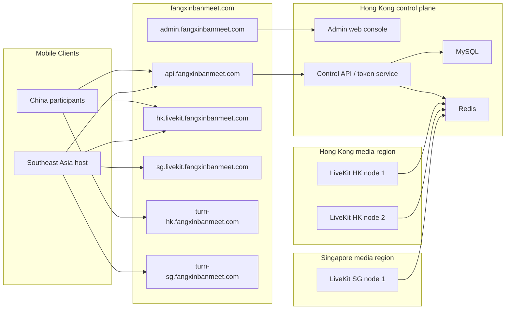

# LiveKit Multi-Node And Admin Console Plan

Updated: 2026-05-06

## 1. Goal

Build a self-hosted LiveKit meeting system for cross-border business meetings.

Primary usage pattern:

- Participants are mainly in mainland China.
- Hosts are mainly in Southeast Asia.
- The current public domain is `fangxinbanmeet.com`.
- The current Hong Kong node is already running a single-node LiveKit test deployment.

Target outcomes:

- Improve meeting smoothness for China and Southeast Asia users.
- Reduce single-node risk by adding regional LiveKit nodes.
- Add an admin console for account CRUD, role management, and device binding management.
- Replace the temporary token service with a real control plane.

## 2. Important LiveKit Architecture Notes

LiveKit self-hosted multi-node mode requires Redis as a shared data store and message bus. When Redis is configured, LiveKit nodes report stats through Redis and can choose an available node based on load.

LiveKit also supports region-aware node selection when combined with region-aware signal routing. This lets clients connect to a nearby signaling endpoint and lets LiveKit choose a room node based on region and load.

Important limitation:

- In self-hosted LiveKit, one room must fit on one LiveKit node.
- Multi-region deployment does not automatically split the same meeting across multiple SFU nodes like a global mesh.
- Room placement matters. If a meeting is created from Singapore and the app routes the host to Singapore, mainland China participants may have higher latency.

Practical decision for this project:

- Default China-facing business meetings should be placed on Hong Kong first.
- Singapore should be used as fallback and for Southeast-Asia-heavy meetings.
- Mainland China nodes should be introduced only after domain, ICP, firewall, and cross-border compliance are clear.

## 3. Recommended Target Architecture

## 4. Server Count Plan

### 4.1 Current State

Current deployment:

- `103.207.68.248` Hong Kong server.
- Runs `nginx`, existing business services, LiveKit test container, and token service.
- Domain `fangxinbanmeet.com` currently points to this Hong Kong server.

This is acceptable for early functional testing, but it is still a single-node deployment.

### 4.2 Minimum Multi-Node Test

Minimum test with existing resources:

| Server | Region | Role |
| --- | --- | --- |
| HK-1 | Hong Kong | Existing Nginx, control API, MySQL, Redis, LiveKit HK node |
| SG-1 | Singapore | LiveKit SG node, TURN SG |

Pros:

- Lowest cost.
- Can verify Redis-based LiveKit multi-node behavior.
- Can verify region selection and fallback logic.

Cons:

- Hong Kong remains overloaded because it hosts both control plane and media.
- Redis and MySQL are not highly available.
- A Hong Kong outage still affects admin/API/token issuance.

### 4.3 Recommended Small-Scale Setup

Recommended small-scale setup:

| Server | Region | Role |
| --- | --- | --- |
| HK-Control-1 | Hong Kong | Nginx, admin web, control API, MySQL, Redis, monitoring |
| HK-Media-1 | Hong Kong | LiveKit HK node, TURN HK |
| SG-Media-1 | Singapore | LiveKit SG node, TURN SG |

Why this is the best next step:

- Separates media workload from the existing Hong Kong application host.
- Keeps the main control plane close to mainland China.
- Adds Singapore fallback and better Southeast Asia coverage.
- Keeps total server count low at 3.

### 4.4 Production Entry Setup

Production entry setup:

| Server | Region | Role |
| --- | --- | --- |
| HK-Control-1 | Hong Kong | Nginx, admin web, control API |
| HK-DB-Redis-1 | Hong Kong | MySQL primary, Redis primary, backups |
| HK-Media-1 | Hong Kong | LiveKit HK node, TURN HK |
| HK-Media-2 | Hong Kong | LiveKit HK node, TURN HK |
| SG-Media-1 | Singapore | LiveKit SG node, TURN SG |
| Monitor-1 | Hong Kong or mainland China | Prometheus, Grafana, uptime checks, log collection |

Optional production additions:

- Add `SG-Media-2` if Southeast Asia usage grows.
- Add mainland China LiveKit or TURN node only after ICP and compliance checks.
- Move MySQL and Redis to managed HA services if available.

## 5. Domain And Routing Plan

Recommended DNS:

| Domain | Target | Purpose |
| --- | --- | --- |
| `fangxinbanmeet.com` | Hong Kong Nginx | Public landing, current compatibility |
| `api.fangxinbanmeet.com` | Hong Kong control API | Mobile API and token issuance |
| `admin.fangxinbanmeet.com` | Hong Kong admin web | Admin console |
| `hk.livekit.fangxinbanmeet.com` | Hong Kong LiveKit LB/Nginx | HK signaling |
| `sg.livekit.fangxinbanmeet.com` | Singapore LiveKit LB/Nginx | SG signaling |
| `turn-hk.fangxinbanmeet.com` | Hong Kong TURN | HK TURN/TLS |
| `turn-sg.fangxinbanmeet.com` | Singapore TURN | SG TURN/TLS |

Routing strategy for phase 1:

- The control API decides meeting region when creating a meeting.
- For China-facing meetings, return `wss://hk.livekit.fangxinbanmeet.com`.
- For Southeast-Asia-only meetings, return `wss://sg.livekit.fangxinbanmeet.com`.
- If HK health check fails, create new meetings in Singapore.
- Existing active meetings cannot be seamlessly migrated between regions.

Routing strategy for later production:

- Add latency probing in the mobile app.
- Add region preference on the host account or meeting creation screen.
- Add GeoDNS or latency-aware DNS after the region policy is stable.

## 6. LiveKit Multi-Node Plan

### 6.1 Shared Redis

Redis will be used by LiveKit nodes for distributed room state and node messaging.

Initial setup:

- One Redis instance in Hong Kong.
- Private firewall rules allow only LiveKit nodes and control API to access Redis.
- Use Redis password.
- Disable public unauthenticated Redis access.

Production setup:

- Redis Sentinel, Redis Cluster, or managed Redis.
- Regular backup of config and persistence if persistence is enabled.
- Monitoring for latency, memory, connections, evictions, and restarts.

### 6.2 LiveKit Node Regions

Proposed region names:

| Region | LiveKit region name | Coordinates |
| --- | --- | --- |
| Hong Kong | `hk` | `22.3193, 114.1694` |
| Singapore | `sg` | `1.3521, 103.8198` |
| Mainland China future | `cn` | To be decided by actual server city |

LiveKit node selector:

- Use `regionaware`.
- Set `sysload_limit` conservatively during testing, for example `0.5`.
- Keep room placement policy in the control API so we can choose HK for China-facing business meetings.

### 6.3 TURN Plan

TURN is required for restrictive enterprise networks and unstable cross-border networks.

Phase 1:

- Keep current UDP/TCP media ports.
- Add TURN/TLS on HK using a dedicated TURN domain.

Phase 2:

- Add TURN/TLS on Singapore.
- Prefer TCP 443 for fallback connectivity.
- Consider TURN/UDP 443 if the host firewall and existing services allow it.

Port intent:

| Port | Protocol | Purpose |
| --- | --- | --- |
| `443` | TCP | HTTPS, WSS, TURN/TLS |
| `443` | UDP | Optional TURN/UDP |
| `3478` | UDP | TURN/STUN UDP |
| `50000-60000` | UDP | Recommended LiveKit media range for production |
| `7881` or custom | TCP | LiveKit TCP fallback |

## 7. Control Plane And Admin Console

### 7.1 Product Scope

Admin console must support:

- Admin login/logout.
- Account list, search, create, update, disable, reset password, delete or soft-delete.
- Role management for super admin, admin, and host.
- Device list by account.
- Device binding and unbinding.
- Meeting list and room status.
- LiveKit node status and health.
- Audit logs for sensitive operations.

Mobile API must support:

- Host login.
- Device binding check.
- Create meeting.
- Join meeting by meeting number.
- Return LiveKit URL and token.
- Region fallback when a node is unhealthy.

### 7.2 Suggested Tech Stack

Backend:

- Node.js with Express first, because the current token service already uses Express.
- Later upgrade to NestJS only if the codebase becomes large.
- MySQL as the primary database because the Hong Kong host already has MySQL.
- Redis for LiveKit cluster state, API rate limiting, and short-lived session/cache data.

Admin web:

- React + Vite.
- Ant Design or Arco Design for fast CRUD screens.
- Deploy as static files behind Nginx.

Authentication:

- Admin console uses JWT access token plus refresh token or server-side session.
- Passwords stored with bcrypt or argon2.
- Device binding uses a generated device ID stored securely in the mobile app.

### 7.3 Database Model Draft

`accounts`

| Field | Notes |
| --- | --- |
| `id` | Primary key |
| `username` | Unique login name |
| `display_name` | Display name |
| `password_hash` | Hashed password |
| `role` | `super_admin`, `admin`, `host` |
| `status` | `active`, `disabled`, `locked` |
| `max_devices` | Default `1` or `2` |
| `created_at` | Created time |
| `updated_at` | Updated time |

`devices`

| Field | Notes |
| --- | --- |
| `id` | Primary key |
| `account_id` | Owner account |
| `device_uid` | Stable app-generated device ID |
| `platform` | `ios`, `android` |
| `device_name` | User-visible device name |
| `app_version` | Client version |
| `status` | `bound`, `unbound`, `blocked` |
| `bound_at` | Bind time |
| `unbound_at` | Unbind time |
| `last_seen_at` | Last API activity |

`meetings`

| Field | Notes |
| --- | --- |
| `id` | Primary key |
| `meeting_number` | Short numeric meeting number |
| `room_name` | LiveKit room name |
| `host_account_id` | Host account |
| `preferred_region` | `hk`, `sg`, future `cn` |
| `livekit_url` | Actual signaling URL returned to clients |
| `status` | `created`, `active`, `ended`, `expired` |
| `created_at` | Created time |
| `ended_at` | End time |

`livekit_nodes`

| Field | Notes |
| --- | --- |
| `id` | Primary key |
| `region` | `hk`, `sg`, future `cn` |
| `name` | Node name |
| `signal_url` | Public WSS URL |
| `status` | `healthy`, `degraded`, `offline`, `draining` |
| `last_health_at` | Last health check time |
| `load_score` | Optional computed load |

`audit_logs`

| Field | Notes |
| --- | --- |
| `id` | Primary key |
| `actor_account_id` | Admin who performed the action |
| `action` | Operation name |
| `target_type` | Account, device, meeting, node |
| `target_id` | Target ID |
| `ip_address` | Client IP |
| `user_agent` | Browser or app info |
| `created_at` | Operation time |

### 7.4 API Draft

Admin APIs:

| Method | Path | Purpose |
| --- | --- | --- |
| `POST` | `/admin/auth/login` | Admin login |
| `POST` | `/admin/auth/logout` | Admin logout |
| `GET` | `/admin/accounts` | Account list/search |
| `POST` | `/admin/accounts` | Create account |
| `GET` | `/admin/accounts/:id` | Account detail |
| `PATCH` | `/admin/accounts/:id` | Update account |
| `POST` | `/admin/accounts/:id/reset-password` | Reset password |
| `POST` | `/admin/accounts/:id/disable` | Disable account |
| `POST` | `/admin/accounts/:id/enable` | Enable account |
| `GET` | `/admin/accounts/:id/devices` | Account devices |
| `POST` | `/admin/devices/:id/unbind` | Unbind device |
| `POST` | `/admin/devices/:id/block` | Block device |
| `GET` | `/admin/meetings` | Meeting list |
| `GET` | `/admin/nodes` | LiveKit node status |
| `GET` | `/admin/audit-logs` | Audit log list |

Mobile APIs:

| Method | Path | Purpose |
| --- | --- | --- |
| `POST` | `/api/auth/login` | Host login |
| `POST` | `/api/devices/bind` | Bind current device |
| `POST` | `/api/devices/heartbeat` | Update device last seen |
| `POST` | `/api/meetings/create` | Create meeting and issue host token |
| `POST` | `/api/meetings/join` | Join by meeting number and issue participant token |
| `GET` | `/api/config` | Return API version and region endpoints |

## 8. Mobile Client Changes

Required changes:

- Replace local-only host account storage with real login API.
- Generate and persist a stable device ID.
- Send device ID, platform, app version, and device name during login or bind.
- Create meeting through `/api/meetings/create`.
- Join meeting through `/api/meetings/join`.
- Show clear errors for disabled account, unbound device, blocked device, expired meeting, and region unavailable.
- Allow host to copy/share meeting number.
- Add optional network diagnostics page later.

Security changes:

- Do not store passwords locally.
- Store access token or session token in secure storage.
- Rotate tokens on logout.
- Do not embed LiveKit API secret in the mobile app.

## 9. Rollout Plan

### Phase 0: Baseline Cleanup

Goal:

- Keep the current single Hong Kong deployment stable.
- Preserve the current working mobile flow.

Tasks:

- Confirm current LiveKit, token service, Nginx, and domain status.
- Move secrets out of local docs where possible.
- Add uptime checks for `https://fangxinbanmeet.com/health`.

Exit criteria:

- Existing app can create and join meetings through `fangxinbanmeet.com`.
- Current deployment document is up to date.

### Phase 1: Admin And Real Account System

Goal:

- Replace temporary host account logic with real account and device control.

Tasks:

- Create backend database schema.
- Build admin login.
- Build account CRUD.
- Build device list, bind, unbind, and block.
- Update mobile login and create-meeting flow.
- Add audit logs.

Exit criteria:

- Admin can create a host account.
- Host can login from mobile.
- First device can bind to host account.
- Admin can unbind or block the device.
- Blocked or unbound device cannot create meetings.

### Phase 2: Hong Kong And Singapore Multi-Node Test

Goal:

- Verify self-hosted LiveKit distributed mode.

Tasks:

- Prepare Singapore LiveKit node.
- Connect HK and SG LiveKit nodes to shared Redis.
- Add region-aware LiveKit config.
- Add `hk.livekit.fangxinbanmeet.com` and `sg.livekit.fangxinbanmeet.com`.
- Update control API to return region-specific LiveKit URL.
- Add node health checks.
- Add manual region override for testing.

Exit criteria:

- New HK meetings can be created on HK endpoint.
- New SG meetings can be created on SG endpoint.
- If one region is marked unhealthy, new meetings can be routed to another healthy region.
- Existing rooms keep running during graceful node drain.

### Phase 3: TURN/TLS And Network Hardening

Goal:

- Improve success rate in enterprise, hotel, and cross-border networks.

Tasks:

- Add TURN/TLS 443 for Hong Kong.
- Add TURN/TLS 443 for Singapore.
- Test mainland China mobile networks, office Wi-Fi, and Southeast Asia networks.
- Add connection diagnostics to admin or internal tools.
- Tune media ports and firewall rules.

Exit criteria:

- Users behind restrictive networks can still join through TURN/TLS.
- Call setup success rate and reconnect behavior are acceptable.
- Packet loss and RTT are visible in monitoring.

### Phase 4: Production Readiness

Goal:

- Make the system safe for paid or business-critical usage.

Tasks:

- Add backup and restore procedure.
- Add monitoring dashboards.
- Add alerting for API, Redis, MySQL, LiveKit nodes, and TURN.
- Add log retention and audit review.
- Add admin role permissions.
- Add deployment rollback steps.
- Run load tests and real cross-border pilot calls.

Exit criteria:

- System has documented runbooks.
- Admin actions are auditable.
- Node failure scenarios have been tested.
- Backup restore has been tested.

### Phase 5: Mainland China Node Evaluation

Goal:

- Decide whether mainland infrastructure improves real meeting quality enough to justify compliance work.

Tasks:

- Confirm ICP filing and domain requirements.
- Confirm whether LiveKit signaling and TURN can legally and operationally run on mainland server.
- Test China mainland node to Hong Kong, Singapore, and local participants.
- Decide whether mainland node should host rooms, provide TURN only, or stay as monitoring/admin support.

Exit criteria:

- Compliance decision is clear.
- Real latency and packet loss data supports the decision.

## 10. Testing And Acceptance

Functional tests:

- Admin creates account.
- Admin disables account.
- Admin resets password.
- Admin unbinds device.
- Mobile host logs in.
- Mobile host creates meeting.
- Guest joins by meeting number.
- Disabled account cannot create meeting.
- Unbound or blocked device cannot create meeting.

Network tests:

- China mobile network to HK meeting.
- China office Wi-Fi to HK meeting.
- Southeast Asia host to HK meeting.
- Southeast Asia host to SG meeting.
- HK failure simulation for new meetings.
- SG failure simulation for new meetings.
- TURN/TLS-only connection test.

Quality metrics:

| Metric | Initial target |
| --- | --- |
| Join success rate | `>= 98%` in pilot |
| Time to first media | `< 5s` normal network |
| Audio RTT China to HK | Track and baseline |
| Packet loss | Alert above sustained `5%` |
| API availability | `>= 99.5%` for small-scale stage |

## 11. Risks And Decisions

Key risks:

- Self-hosted rooms stay on one node, so wrong room placement can hurt China participants.
- Cross-border packet loss may still require TURN/TLS or a mainland strategy.
- Redis becomes critical infrastructure in multi-node mode.
- Existing Hong Kong server already runs several services and should not become the long-term media-heavy node.
- Mainland server usage may require ICP and other compliance checks.

Decisions to confirm before implementation:

- Whether to create `api`, `admin`, `hk.livekit`, `sg.livekit`, `turn-hk`, and `turn-sg` subdomains now.
- Whether to use the existing Hong Kong MySQL or deploy a separate database host.
- Whether host accounts should allow one device only or multiple devices.
- Whether participants should remain anonymous by meeting number or require name/phone verification.
- Whether Singapore should be fallback only or selectable by hosts.

## 12. Immediate Next Work

Recommended next work order:

1. Build the admin/control-plane database schema and APIs.
2. Replace temporary token service with the new control API while keeping the same mobile API paths.
3. Add admin web account CRUD and device unbinding.
4. Add Singapore LiveKit node and Redis-based distributed config.
5. Add TURN/TLS 443 after basic multi-node behavior is verified.

## 13. Reference Links

- LiveKit distributed multi-region docs: https://docs.livekit.io/home/self-hosting/distributed
- LiveKit deployment and TURN docs: https://docs.livekit.io/home/self-hosting/deployment/
